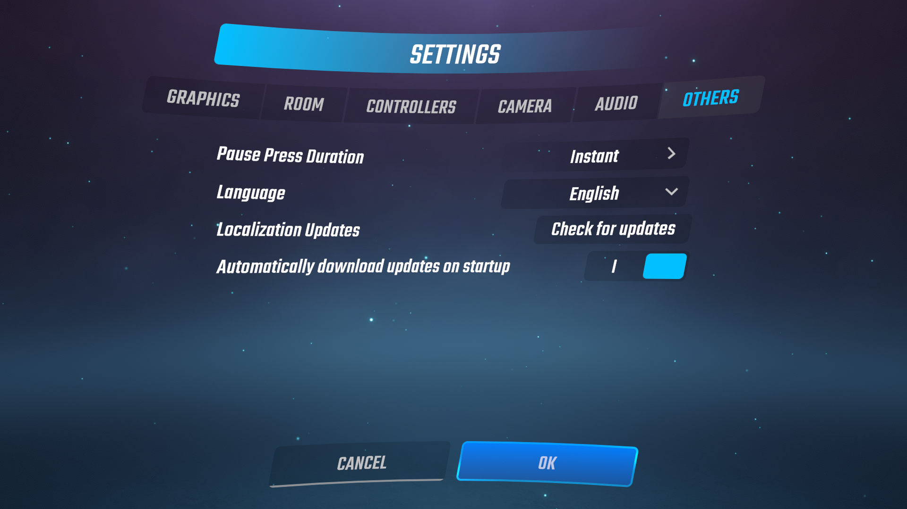
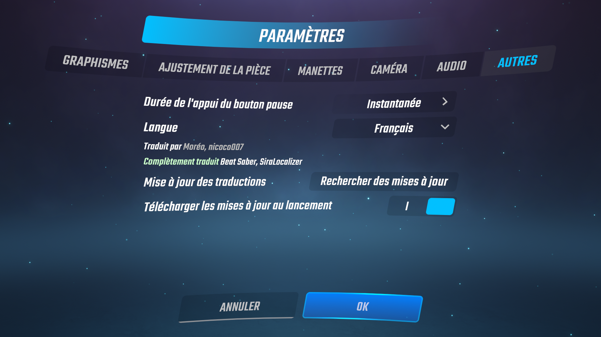

# SiraLocalizer
Community localization support for Beat Saber and its mods. Created by nicoco007 and Auros.

Requires [SiraUtil](https://github.com/Auros/SiraUtil/releases/latest) 3.0.0 or greater.

## Supported Languages for the Base Game
The community has unofficially translated the base game into the following languages:
* Chinese (Simplified)
* Chinese (Traditional)
* Dutch
* French
* German
* Hebrew
* Hungarian
* Italian
* Japanese
* Korean
* Portuguese (Brazilian)
* Russian
* Swedish

See [CONTRIBUTORS](CONTRIBUTORS.md) for a list of everyone who has helped make SiraLocalizer possible!

Since SiraLocalizer is built on top of the game's regular localization system, you can change the language in-game normally by going to *Options* > *Settings* > *Others*. There are additional settings made available to manage translation updates.


Translation contributors and information regarding which mods are supported is given under the language selection dropdown. The example below shows information for the French translation:


## Becoming a Translator
See [CONTRIBUTING](CONTRIBUTING.md).

## Getting SiraLocalizer to Translate Your Mod
*This section is under construction!*
### Preparing a Mod for Translation
Beat Saber uses the [Polyglot](https://github.com/agens-no/PolyglotUnity) Unity package for translations. It uses translation keys as unique identifiers for translated text across the game. Therefore, wherever there is text in your mod, it should be replaced with something that can convert a translation key into localized text.

[BeatSaberMarkupLanguage](https://github.com/monkeymanboy/BeatSaberMarkupLanguage) now supports translating various text elements with the `-key` suffix (e.g. `text-key` for text, `tab-name-key` for tabs, etc.). More documentation regarding this is coming soon. If you are displaying text through other means, you can use the `Polyglot.Localization.Get(string)` and `Polyglot.Localization.GetFormat(string, params object[])` methods to get localized strings in the current language.

### Choosing Good Translation Keys
Here are some guidelines for creating good translation keys:
- A translation key should succinctly describe the text it represents. There is no hard limit on length, but it shouldn't just be the whole sentence.
- By convention, translation keys should be in SCREAMING_SNAKE_CASE (uppercase letters, words separated by underscores).
- Context is very important when translating. Avoid re-using the same key at multiple places even if the English text is the same unless the context is identical.
- To avoid collisions with base game keys and other mods' keys, all the keys you add should have a prefix that uniquely identifies your mod.

### Creating a Polyglot Translation File
Polyglot stores translations in CSV or TSV files. We *highly* recommend using a CSV file since it supports line breaks inside values and empty columns are easier to format. Polyglot's file format is very straightforward: the first column is the translation key, the second column is context to help translators, and the rest of the columns are translations following [the order in the Locale enum](SiraLocalizer/Locale.cs).

If you plan on using SiraLocalizer for translations, this is what your mod's CSV file should look like:
```text
Polyglot,100,,,,,,,,,,,,,,,,,,,,,,,,,,,,
"KEY_NAME_1","Context for 1 if necessary","English String 1",,,,,,,,,,,,,,,,,,,,,,,,,,,
"KEY_NAME_2","Context for 2 if necessary","English String 2",,,,,,,,,,,,,,,,,,,,,,,,,,,
```

The first line is required for Polyglot to properly identify the file. Also, note the trailing commas &ndash; these are important since Polyglot will show the translation key instead of the fallback (English) text if a column doesn't exist for the selected language. Since Polyglot supports 28 languages out-of-the-box, there should be at least 27 commas after the English text.

Once you've added all the translation keys for your mod in a CSV file following the format above, it needs to be loaded when the game starts. We recommend doing this by adding your CSV file as an embedded resource within your mod. It can then be loaded at runtime in two different ways.

#### Through SiraLocalizer
This is the recommended way to add your file since if anything changes within the game itself, you don't have to worry about it. You must however add SiraLocalizer as a dependency to your mod. Below is an example of how to do this. Note that this requires use of Zenject (via SiraUtil, for example).

```cs
using SiraLocalizer;

namespace YourMod
{
    class YourLocalizationRegistrar : IInitializable
    {
        private ILocalizer _localizer;

        internal YourLocalizationRegistrar(ILocalizer localizer)
        {
            _localizer = localizer;
        }

        public void Initialize()
        {
            _localizer.AddLocalizationAssetFromAssembly("Assembly.Path.To.Your.translations.csv", GoogleDriveDownloadFormat.CSV);
        }
    }
}
```

The `YourLocalizationRegistrar` class should be bound to an installer that runs on the main Beat Saber context (e.g. a `YourAppInstaller` installer registered via `Zenjector.OnApp<YourAppInstaller>()`).

#### Manually
This method should only be used if you don't want to add SiraLocalizer as a dependency to your mod. Since this is prone to change, we don't officially endorse or support this method. We will try our best to keep it working in the future but we can't guarantee this will be possible, so if you decide to use it, you're on your own. Below is an example of how to add your CSV file. You should call this in your plugin's [OnStart] method.

```cs
using (var reader = new StreamReader(Assembly.GetExecutingAssembly().GetManifestResourceStream("Assembly.Path.To.Your.translations.csv")))
{
    string content = reader.ReadToEnd();
    Localization.Instance.InputFiles.Add(new LocalizationAsset { Format = GoogleDriveDownloadFormat.CSV, TextAsset = new TextAsset(content) });
}
```

You should call this method in your plugin's `[OnEnable]` or `[OnStart]` method. If everything works properly, translations keys should now show up as the English text you wrote in the CSV file.

### Registering a Mod for Translation
Registering your mod to be translated by the SiraLocalizer team is simple. First, fill out this request form (coming soon). If it the first time you request translations, you will be given an ID for your mod. Once you have this ID, simply add this JSON object to your manifest's `features` object:

```json
"SiraLocalizer.LocalizedPlugin": {
    "id": "your-mod-id",
    "resourcePath": "Assembly.Path.To.Your.translations.csv"
}
```

Once translations are available, they will automatically be downloaded by SiraLocalizer.
